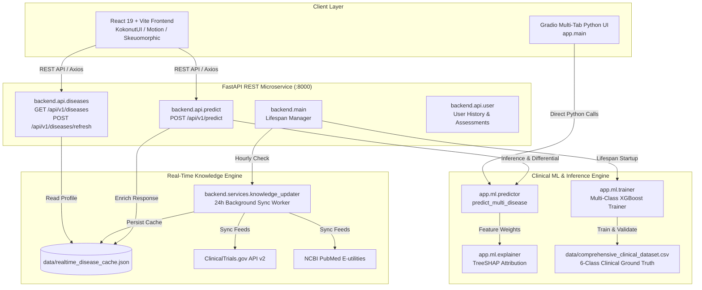

# 🏥 MediPredict AI — Multi-Disease Risk Prediction & Clinical Intelligence Platform

An enterprise-grade, clinical-grade multi-disease risk prediction and explainable AI platform. Powered by **XGBoost** with **TreeSHAP** feature attribution, a high-performance **FastAPI** REST microservice, an automated **24-hour real-time synchronization engine** (integrating ClinicalTrials.gov API v2 & NCBI PubMed E-utilities), and a modern **React 19 + Vite** frontend styled in light skeuomorphic aesthetic with Motion animations and KokonutUI/Shadcn tokens. A standalone **Gradio** web dashboard is also included for Python-only environments.

---

## 📑 Table of Contents
1. [System Architecture](#-system-architecture)
2. [Project File Directory](#-project-file-directory)
3. [Comprehensive File-by-File Documentation](#-comprehensive-file-by-file-documentation)
   - [Root Configuration & Documentation](#1-root-configuration--documentation)
   - [Core Python App (`app/`)](#2-core-python-app-app)
   - [Machine Learning Engine (`app/ml/`)](#3-machine-learning-engine-appml)
   - [Gradio UI & Clinical Chatbot (`app/ui/` & `app/chat/`)](#4-gradio-ui--clinical-chatbot-appui--appchat)
   - [FastAPI Microservice Backend (`backend/`)](#5-fastapi-microservice-backend-backend)
   - [Dynamic Synchronization Engine (`backend/services/`)](#6-dynamic-synchronization-engine-backendservices)
   - [Clinical Datasets & Caches (`data/`)](#7-clinical-datasets--caches-data)
   - [React 19 + Vite Frontend (`frontend/`)](#8-react-19--vite-frontend-frontend)
4. [Quick Start & Setup](#-quick-start--setup)
5. [Clinical Machine Learning Pipeline](#-clinical-machine-learning-pipeline)
6. [24-Hour Real-Time Sync Engine](#-24-hour-real-time-sync-engine)
7. [Medical Disclaimer](#-medical-disclaimer)

---

## 🏛 System Architecture



---

## 📂 Project File Directory

```
disease-prediction-prototype/
├── .gitignore                                # Git ignore rules for Python, Node, & OS artifacts
├── pyrightconfig.json                        # Pyright & VSCode language server configuration
├── README.md                                 # Comprehensive platform documentation
├── requirements.txt                          # Python dependencies and pinned versions
│
├── docs/                                     # Architectural specifications & system design
│   ├── model_prototype_design.md             # Multi-disease ML model architecture & design spec
│   └── system_design.md                      # High-level system design & API contract documentation
│
├── data/                                     # Clinical data stores & dynamic caches
│   ├── chronic_disease_dataset.csv           # Legacy 2-class dataset for Chronic conditions
│   ├── comprehensive_clinical_dataset.csv    # 6-class balanced clinical ground truth dataset (3,000 rows)
│   ├── critical_disease_dataset.csv          # Legacy 2-class dataset for Cardiovascular conditions
│   ├── lifestyle_disease_dataset.csv         # Legacy 2-class dataset for Metabolic conditions
│   └── realtime_disease_cache.json           # 24-hour synchronized clinical knowledge cache
│
├── app/                                      # Standalone Python package & Gradio UI
│   ├── __init__.py                           # App package initializer
│   ├── config.py                             # Central configuration, file paths, and hyperparameters
│   ├── main.py                               # Gradio application entry point (python -m app.main)
│   ├── chat/                                 # Clinical rule-based chatbot
│   │   ├── __init__.py                       # Chat package initializer
│   │   └── knowledge_engine.py               # Deterministic medical QA & symptom triage engine
│   ├── ml/                                   # Machine Learning core pipeline
│   │   ├── __init__.py                       # ML package initializer
│   │   ├── data_generator.py                 # Clinically-bounded synthetic dataset generator
│   │   ├── explainer.py                      # TreeSHAP explainability & feature attribution
│   │   ├── predictor.py                      # Multi-disease inference engine & risk scoring
│   │   └── trainer.py                        # Model training, stratification, & evaluation
│   └── ui/                                   # Gradio Web UI components
│       ├── __init__.py                       # UI package initializer
│       ├── layout.py                         # Gradio tab assembly and page structure
│       ├── theme.py                          # Soft Medical custom theme for Gradio
│       └── tabs/                             # Individual workflow tabs
│           ├── __init__.py                   # Tabs package initializer
│           ├── chat_tab.py                   # Medical assistant chatbot tab
│           ├── chronic_tab.py                # Chronic disease risk assessment tab
│           ├── critical_tab.py               # Cardiovascular critical risk assessment tab
│           └── lifestyle_tab.py              # Lifestyle disease risk assessment tab
│
├── backend/                                  # High-performance FastAPI REST API service
│   ├── __init__.py                           # Backend package initializer
│   ├── main.py                               # FastAPI application entry point & lifespan manager
│   ├── schemas.py                            # Pydantic v2 data models & validation schemas
│   ├── api/                                  # REST API endpoint routers
│   │   ├── __init__.py                       # API package initializer
│   │   ├── diseases.py                       # Disease knowledge base & sync status routes
│   │   ├── predict.py                        # Multi-disease clinical inference endpoint
│   │   └── user.py                           # User profile & assessment history management
│   └── services/                             # Real-time background background services
│       ├── __init__.py                       # Services package initializer
│       └── knowledge_updater.py              # 24-hour sync engine (ClinicalTrials.gov & PubMed)
│
└── frontend/                                 # Modern React 19 + Vite single-page application
    ├── .env                                  # Environment variables (VITE_API_URL)
    ├── .env.example                          # Example environment configuration template
    ├── .gitignore                            # Frontend-specific git ignore rules
    ├── .oxlintrc.json                        # Oxlint code linter configuration
    ├── index.html                            # HTML entry point with Google Fonts (Plus Jakarta Sans)
    ├── package.json                          # Node.js project manifest & script commands
    ├── package-lock.json                     # Locked dependency tree
    ├── README.md                             # Frontend-specific documentation
    ├── vite.config.js                        # Vite bundler configuration & proxy setup
    ├── public/                               # Public static assets
    │   ├── favicon.svg                       # Medical cross favicon
    │   └── icons.svg                         # SVG icon definitions
    └── src/                                  # React application source code
        ├── App.css                           # Application base styles
        ├── App.jsx                           # Primary application shell, navigation, & router
        ├── index.css                         # Design system tokens, skeuomorphic shadows, & CSS variables
        ├── main.jsx                          # React DOM client entry point
        ├── assets/                           # Bundled media & SVG assets
        │   ├── hero.png                      # Clinical dashboard hero image
        │   ├── react.svg                     # React brand icon
        │   └── vite.svg                      # Vite brand icon
        ├── pages/                            # Full-page views
        │   ├── Dashboard.jsx                 # Bento-grid clinical overview & trend metrics
        │   ├── DiseaseInfoPage.jsx           # Comprehensive visual disease encyclopedia with 24h sync
        │   ├── PredictionForm.jsx            # Multi-step animated clinical data collection form
        │   └── ResultCard.jsx                # Diagnostic result dashboard with SVG risk speedometer & SHAP
        └── services/                         # External communication services
            └── api.js                        # Axios REST API client with error interceptors
```

---

## 🔍 Comprehensive File-by-File Documentation

### 1. Root Configuration & Documentation

#### `README.md`
- **Role**: Root repository documentation.
- **Description**: Provides an exhaustive explanation of the entire system, architecture diagrams, every file's purpose, setup commands, ML methodologies, and medical disclaimers.

#### `requirements.txt`
- **Role**: Python dependency registry.
- **Description**: Declares pinned dependencies required to run the ML training pipeline, FastAPI microservice, and Gradio interface. Includes `xgboost`, `shap`, `scikit-learn`, `fastapi`, `uvicorn`, `pydantic`, `pandas`, `numpy`, and `gradio`.

#### `.gitignore`
- **Role**: Source control filter.
- **Description**: Prevents compiled binaries, Python bytecode (`__pycache__/`, `*.pyc`), virtual environments (`venv/`), Node dependencies (`node_modules/`), production builds (`frontend/dist/`), log files, and local system files from being committed to Git.

#### `pyrightconfig.json`
- **Role**: Static type checker configuration.
- **Description**: Configures Pyright and Pydantic language server analysis parameters, Python version target (3.13), and execution environment paths.

#### `docs/model_prototype_design.md`
- **Role**: ML engineering specification.
- **Description**: Architectural documentation detailing the transition from single-disease binary classifiers to a unified multi-class clinical diagnostic engine. Covers target class definitions, feature distributions, loss formulation, and evaluation metrics.

#### `docs/system_design.md`
- **Role**: System architecture documentation.
- **Description**: Technical specification detailing the interaction between the React frontend, FastAPI gateway, ML inference pipelines, and background data synchronization workflows.

---

### 2. Core Python App (`app/`)

#### `app/__init__.py`
- **Role**: Python package marker.
- **Description**: Initializes the `app` namespace, allowing internal modules (`app.ml`, `app.ui`, `app.chat`) to be discovered and imported cleanly.

#### `app/config.py`
- **Role**: Global application settings and clinical taxonomy.
- **Description**: Central configuration file defining filesystem paths (`BASE_DIR`, `DATA_DIR`), dataset file references, target columns (`disease_target`), disease class index mappings (0: Healthy, 1: Type 2 Diabetes, 2: Hypertension, 3: CKD, 4: COPD, 5: CAD), the 20 monitored clinical symptoms, and XGBoost hyperparameters.

#### `app/main.py`
- **Role**: Gradio web application entry point.
- **Description**: Launches the standalone Gradio web interface (`http://localhost:7860`). Trains models on startup if not already cached and renders the multi-tab layout with theme styling.

---

### 3. Machine Learning Engine (`app/ml/`)

#### `app/ml/__init__.py`
- **Role**: ML module package marker.
- **Description**: Exposes `trainer`, `predictor`, `explainer`, and `data_generator` within the `app.ml` namespace.

#### `app/ml/data_generator.py`
- **Role**: Synthetic clinical data generator.
- **Description**: Generates a 3,000-record, clinically-realistic balanced multi-disease dataset (`data/comprehensive_clinical_dataset.csv`). Incorporates physiological distributions, biomarker correlations (e.g., fasting glucose, blood pressure, cholesterol, BMI), lifestyle habits, and 20 distinct binary symptom indicators for all 6 target classes.

#### `app/ml/trainer.py`
- **Role**: Model training & validation pipeline.
- **Description**: Loads the clinical dataset, performs stratified train-test splitting (80/20), trains an `XGBClassifier` with multi-class log-loss, evaluates accuracy, precision, recall, and F1-score, and caches the trained model in memory.

#### `app/ml/predictor.py`
- **Role**: Multi-disease clinical inference engine.
- **Description**: Core diagnostic function (`predict_multi_disease`). Accepts raw patient demographics, vitals, lab biomarkers, lifestyle factors, wearable signals, and symptom arrays; constructs standardized feature vectors; calculates predicted class probabilities; computes a calibrated clinical risk score (0–100); determines risk tier (Low, Medium, High, Critical); and ranks differential diagnoses.

#### `app/ml/explainer.py`
- **Role**: Explainable AI (XAI) feature attribution.
- **Description**: Uses TreeSHAP (`shap.TreeExplainer`) to compute local feature attribution values for each individual prediction. Generates human-readable explanations highlighting which specific biomarkers and lifestyle deficits drove the risk score.

---

### 4. Gradio UI & Clinical Chatbot (`app/ui/` & `app/chat/`)

#### `app/ui/__init__.py` & `app/ui/tabs/__init__.py`
- **Role**: Package initializers for the Gradio interface.

#### `app/ui/layout.py`
- **Role**: Gradio page assembler.
- **Description**: Assembles the header, disclaimer banner, navigation tabs, and footer into a cohesive Gradio layout.

#### `app/ui/theme.py`
- **Role**: Gradio theme definition.
- **Description**: Customizes the Gradio UI with a "Soft Medical" aesthetic, establishing teal/slate color palettes, clean font typography, rounded borders, and medical card styles.

#### `app/ui/tabs/lifestyle_tab.py`
- **Role**: Lifestyle risk tab.
- **Description**: Gradio input interface for metabolic and lifestyle risk prediction (Type 2 Diabetes, Hypertension).

#### `app/ui/tabs/chronic_tab.py`
- **Role**: Chronic disease risk tab.
- **Description**: Gradio input interface for kidney and pulmonary conditions (CKD, COPD).

#### `app/ui/tabs/critical_tab.py`
- **Role**: Critical cardiovascular risk tab.
- **Description**: Gradio input interface for acute coronary artery disease assessment.

#### `app/ui/tabs/chat_tab.py`
- **Role**: Medical chat interface.
- **Description**: Interactive conversational tab connected to the knowledge engine.

#### `app/chat/__init__.py`
- **Role**: Chat package marker.

#### `app/chat/knowledge_engine.py`
- **Role**: Rule-based medical conversational AI.
- **Description**: Medical chatbot engine with keyword parsing, symptom triage rules, and preventative guidance for lifestyle and chronic diseases.

---

### 5. FastAPI Microservice Backend (`backend/`)

#### `backend/__init__.py` & `backend/api/__init__.py`
- **Role**: Backend package markers.

#### `backend/main.py`
- **Role**: FastAPI application root and lifespan controller.
- **Description**: Initializes the FastAPI app instance (`MediPredict AI — Backend API`), sets up CORS middleware for Vite development servers, mounts all API routers under `/api/v1`, trains models once during startup via `lifespan()`, and launches the hourly background synchronization task.

#### `backend/schemas.py`
- **Role**: Pydantic v2 data models & request/response contracts.
- **Description**: Strictly defines all data payloads: `PredictionRequest`, `PredictionResponse`, `TopPrediction`, `Explainability`, `BiomarkerRange`, `DiseaseStage`, `TargetOrgan`, `ActionableProtocol`, `ClinicalTrial`, `PubMedPaper`, and `KnowledgeBaseSyncStatus`.

#### `backend/api/predict.py`
- **Role**: Prediction router (`POST /api/v1/predict`).
- **Description**: Handles clinical prediction requests. Parses blood pressure strings, runs `predict_multi_disease`, generates SHAP summaries, retrieves the synchronized disease profile via `_get_profile()`, saves records to user history, and returns the response.

#### `backend/api/diseases.py`
- **Role**: Disease knowledge base router (`GET /api/v1/diseases`, `POST /api/v1/diseases/refresh`).
- **Description**: Serves disease profile listings with 24-hour sync status, provides complete point-by-point clinical profiles for any selected condition (`GET /api/v1/diseases/{name}`), triggers on-demand background refreshes, and exposes a backwards-compatible `_DBProxy`.

#### `backend/api/user.py`
- **Role**: User session router (`GET /api/v1/user/history`, `POST /api/v1/user/profile`).
- **Description**: Manages patient sessions, persists prediction history, and calculates trend statistics (average risk, total assessments completed).

---

### 6. Dynamic Synchronization Engine (`backend/services/`)

#### `backend/services/__init__.py`
- **Role**: Services package marker.

#### `backend/services/knowledge_updater.py`
- **Role**: 24-hour real-time clinical synchronization engine.
- **Description**: Queries live medical research databases:
  1. **ClinicalTrials.gov API v2**: Fetches active clinical trials, study titles, recruiting status, and NCT URLs.
  2. **NCBI PubMed E-utilities**: Queries peer-reviewed biomedical literature, guidelines, and PMID links.
  
  Implements multi-threaded concurrent fetching, checks cache staleness against a 24-hour TTL, maintains an in-memory cache, persists cache to `data/realtime_disease_cache.json`, and provides a continuous background worker (`background_sync_worker`) that runs inside the FastAPI event loop.

---

### 7. Clinical Datasets & Caches (`data/`)

#### `data/comprehensive_clinical_dataset.csv`
- **Role**: Primary multi-disease training dataset.
- **Description**: Balanced 3,000-row CSV containing 6 classes (`Healthy`, `Type 2 Diabetes`, `Hypertension`, `Chronic Kidney Disease`, `COPD`, `Coronary Artery Disease`) with 32 clinical features (demographics, vitals, lab biomarkers, lifestyle habits, wearable metrics, and 20 binary symptom indicators).

#### `data/realtime_disease_cache.json`
- **Role**: 24-hour synchronized clinical knowledge cache.
- **Description**: JSON file storing rich clinical profiles for each monitored disease. Includes point-by-point biomarker reference ranges, 4-stage progression criteria, target organ damage mechanisms, Do's/Don'ts protocols, diagnostic screening schedules, and real-time ClinicalTrials.gov/PubMed feeds.

#### `data/lifestyle_disease_dataset.csv`, `chronic_disease_dataset.csv`, `critical_disease_dataset.csv`
- **Role**: Legacy binary classification datasets.
- **Description**: Baseline datasets preserved for backward compatibility with individual category training and Gradio tabs.

---

### 8. React 19 + Vite Frontend (`frontend/`)

#### `frontend/package.json` & `frontend/package-lock.json`
- **Role**: Node.js dependencies and build scripts.
- **Description**: Configures scripts (`dev`, `build`, `preview`) and dependencies: `react`, `react-dom`, `lucide-react` (icons), `motion` (animations), `axios` (HTTP requests), and `@vitejs/plugin-react`.

#### `frontend/vite.config.js`
- **Role**: Vite build tool configuration.
- **Description**: Sets up the React plugin, dev server port (5173), and proxy routing for backend requests.

#### `frontend/index.html`
- **Role**: Single-page application HTML entry.
- **Description**: Defines viewport meta tags, loads Google Fonts (`Plus Jakarta Sans`), and establishes the root DOM mount point (`<div id="root">`).

#### `frontend/.env` & `frontend/.env.example`
- **Role**: Frontend environment configuration.
- **Description**: Specifies `VITE_API_URL=http://localhost:8000` to connect the React application to the FastAPI microservice.

#### `frontend/.gitignore`
- **Role**: Frontend git ignore rules.
- **Description**: Ignores `node_modules/`, `dist/`, and local environment overrides.

#### `frontend/.oxlintrc.json`
- **Role**: Linter rules.
- **Description**: Configures code quality rules for modern JSX and React best practices.

#### `frontend/README.md`
- **Role**: Frontend-specific documentation.
- **Description**: Quick start and architectural summary of the React single-page app.

#### `frontend/public/favicon.svg` & `frontend/public/icons.svg`
- **Role**: Vector iconography and browser favicon.

#### `frontend/src/main.jsx`
- **Role**: React client entry point.
- **Description**: Renders `<App />` inside React `StrictMode` into the `#root` element.

#### `frontend/src/App.jsx`
- **Role**: Master application layout & routing shell.
- **Description**: Renders the floating glassmorphic header, navigation bar with badge counters, notification center, and dynamic tab switching between `Dashboard`, `PredictionForm`, and `DiseaseInfoPage`.

#### `frontend/src/App.css` & `frontend/src/index.css`
- **Role**: Design system styling tokens.
- **Description**: Implements a light skeuomorphic aesthetic with soft inset/outset drop shadows, KokonutUI glass cards, segmented tab switches, gradient badges, and responsive CSS variables.

#### `frontend/src/assets/hero.png`, `react.svg`, `vite.svg`
- **Role**: Visual media and brand graphics.

#### `frontend/src/services/api.js`
- **Role**: Centralized Axios API service.
- **Description**: Encapsulates all backend REST calls: `predictDisease()`, `getDiseases()`, `getDiseaseDetails()`, `refreshDiseases()`, `getSyncStatus()`, and `getUserHistory()`. Includes request timeout handling and helpful error messages.

#### `frontend/src/pages/Dashboard.jsx`
- **Role**: Clinical overview dashboard.
- **Description**: Bento-grid layout displaying clinical summary metrics, recent patient assessment logs, risk tier breakdowns, quick action cards, and 24-hour synchronization status.

#### `frontend/src/pages/PredictionForm.jsx`
- **Role**: Multi-step clinical assessment intake form.
- **Description**: 3-step animated form (`Demographics & Vitals` → `Lifestyle Factors` → `Wearables & Symptoms`) with interactive sliders, segmented buttons, 20 symptom toggles, payload validation, and animated step transitions powered by `motion/react`.

#### `frontend/src/pages/ResultCard.jsx`
- **Role**: Diagnostic prediction & risk visualization card.
- **Description**: Renders an animated SVG risk speedometer gauge (0–100), primary diagnosis banner, ranked differential list with confidence percentages, interactive SHAP feature attribution bars, and point-by-point clinical breakdown.

#### `frontend/src/pages/DiseaseInfoPage.jsx`
- **Role**: Visual disease encyclopedia.
- **Description**: Detailed point-by-point breakdown for all 6 conditions:
  - Visual biomarker ranges with normal, borderline, and critical thresholds
  - 4-stage clinical progression roadmap with reversibility indicators
  - Early warning signs vs. acute emergency symptoms
  - Target organ vulnerability mapping
  - Actionable Do's (green) & Don'ts (red) protocol checklist
  - Live clinical trials and recent PubMed publications with external links
  - On-demand 24h sync trigger button with live countdown timer

---

## 🚀 Quick Start & Setup

### Prerequisites
- **Python**: Version 3.10 to 3.13
- **Node.js**: Version 18.x or higher
- **npm**: Version 9.x or higher

### Option A: Full-Stack Mode (React + FastAPI) — Recommended

#### 1. Start the FastAPI Backend
```bash
# Clone the repository
git clone https://github.com/Bunny-1432/disease-prediction-prototype.git
cd disease-prediction-prototype

# Install Python dependencies
pip install -r requirements.txt

# Start the FastAPI server (trains models on first run)
python -m uvicorn backend.main:app --host 127.0.0.1 --port 8000 --reload
```
*Backend runs at `http://127.0.0.1:8000` (Swagger docs at `http://127.0.0.1:8000/docs`).*

#### 2. Start the React Frontend
In a new terminal window:
```bash
cd frontend

# Install Node dependencies
npm install

# Start Vite dev server
npm run dev
```
*Frontend opens at `http://localhost:5173`.*

---

### Option B: Standalone Gradio Python UI

If you only want to run the Python interface without Node:
```bash
pip install -r requirements.txt
python -m app.main
```
*Opens at `http://localhost:7860`.*

---

### Option C: Re-generating Synthetic Data & Retraining Models

To regenerate the 3,000-sample balanced dataset and retrain the XGBoost models:
```bash
# Regenerate clinical dataset
python -m app.ml.data_generator

# Train and validate models
python -m app.ml.trainer
```

---

## 🧠 Clinical Machine Learning Pipeline

```
Raw Patient Input (Vitals, Lab Values, Wearables, Symptoms)
                           │
                           ▼
          Standardized Clinical Feature Vector (32 dims)
                           │
                           ▼
          6-Class Stratified XGBoost Classifier
                           │
       ┌───────────────────┴───────────────────┐
       ▼                                       ▼
Class Probabilities                     TreeSHAP Explainer
       │                                       │
       ▼                                       ▼
Calibrated Risk Score (0-100)           Local Feature Attributions
       │                                       │
       ▼                                       ▼
Risk Tier (Low/Med/High/Crit)           Top Risk Contributing Factors
```

### Monitored Conditions
1. **Healthy / Optimal Baseline** (Risk 0–29)
2. **Type 2 Diabetes** (Metabolic disorder with insulin resistance)
3. **Hypertension** (Systolic/Diastolic cardiovascular strain)
4. **Chronic Kidney Disease (CKD)** (Glomerular filtration deficit & fluid retention)
5. **COPD** (Chronic Obstructive Pulmonary Disease with airflow obstruction)
6. **Coronary Artery Disease (CAD)** (Atherosclerotic ischemic heart disease)

---

## 🔄 24-Hour Real-Time Sync Engine

MediPredict AI features an automated background worker that refreshes medical evidence every 24 hours:

```
FastAPI Lifespan Startup
       │
       ▼
Hourly Background Worker (checks 24h TTL)
       │
       ├── Cache < 24h old  ──►  Serve local JSON cache instantly (<5ms)
       │
       └── Cache >= 24h old ──►  Execute concurrent thread pool sync:
                                   ├── ClinicalTrials.gov API v2 (active trials)
                                   ├── NCBI PubMed E-utilities (latest research)
                                   └── Persist to data/realtime_disease_cache.json
```

---

## ⚠️ Medical Disclaimer

**IMPORTANT NOTICE**: This software is intended solely for **research, educational, and prototyping purposes**. It does **NOT** provide medical advice, clinical diagnosis, or treatment plans. Predictions are statistical approximations based on machine learning models and must never replace the judgment of licensed healthcare professionals. In case of a medical emergency, immediately contact your local emergency medical services.
