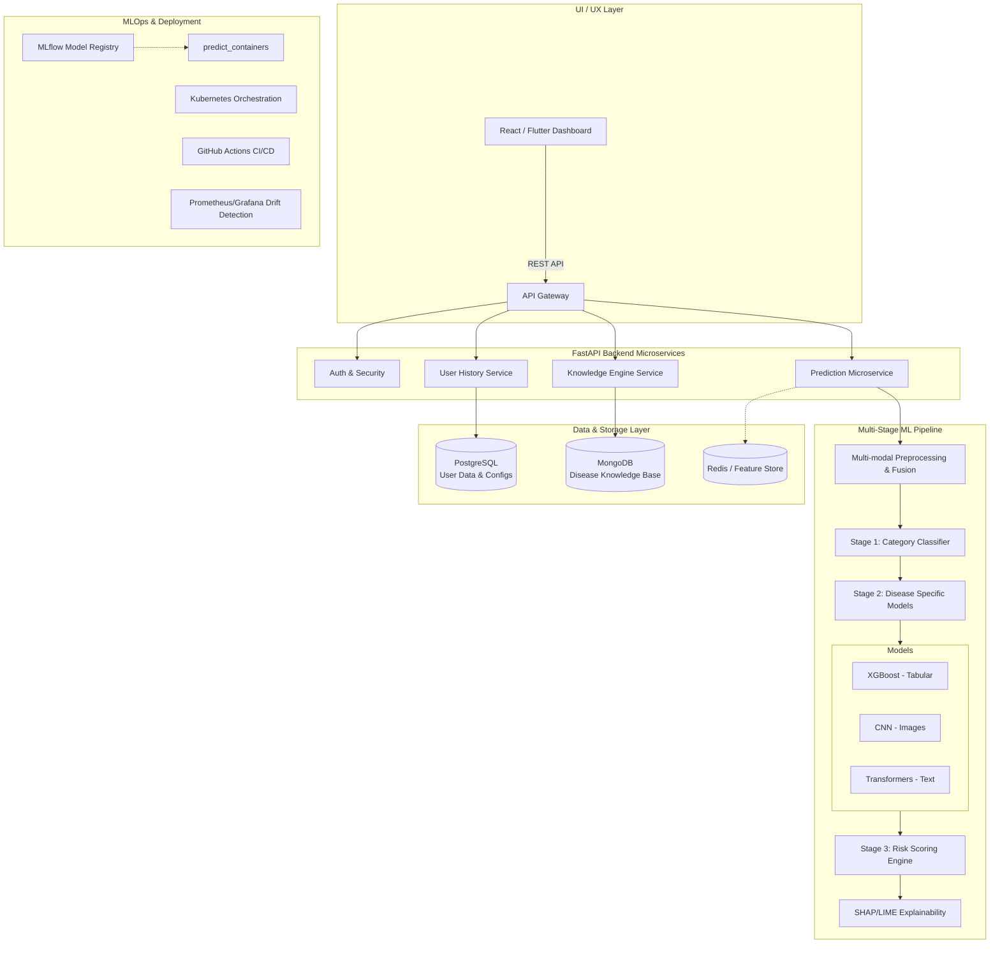

# Multi-Disease Prediction System Prototype

This document provides a comprehensive design and architectural prototype for an end-to-end Multi-Disease Prediction System, satisfying all requested technical, algorithmic, and operational requirements.

## 1. System Architecture Diagram (Logical & Deployment)



## 2. Complete Folder Structure (Production-Ready)

```text
multi-disease-prediction/
├── backend/                  # FastAPI Backend Services
│   ├── app/
│   │   ├── api/              # API endpoints (/predict, /disease-info, /risk-analysis)
│   │   ├── core/             # Config, security, audit logs
│   │   ├── schemas/          # Pydantic validation schemas
│   │   ├── models/           # DB schemas (SQLAlchemy, Beanie/Motor for MongoDB)
│   │   ├── services/         # Business logic & ML inference integrations
│   │   └── main.py           # FastAPI application entry
│   ├── tests/                # Unit & integration tests
│   ├── Dockerfile            # Backend container
│   └── requirements.txt
├── ml_pipeline/              # Machine Learning Training & Inference
│   ├── data/                 # Data versioning & schemas
│   ├── src/
│   │   ├── preprocessing/    # Data cleaning & modality fusion (images, text, tabular)
│   │   ├── models/           # Scikit-learn, TF, PyTorch model definitions
│   │   ├── explainability/   # SHAP/LIME global and local generators
│   │   ├── inference/        # Model wrappers & Risk Engine
│   │   └── train.py          # Automated retraining script
│   ├── mlruns/               # MLflow tracking and experiment logs
│   ├── Dockerfile.ml         # ML inference microservice container
│   └── requirements.txt
├── frontend/                 # React or Flutter Dashboard
│   ├── src/
│   │   ├── components/       # Visuals (Charts, SHAP explanation UI, Knowledge cards)
│   │   ├── pages/            # Dashboard, Input Form, Results View
│   │   ├── services/         # API integration & state management
│   │   └── App.js
│   ├── Dockerfile.frontend
│   └── package.json
├── k8s/                      # Kubernetes Orchestration
│   ├── backend-deployment.yaml
│   ├── ml-deployment.yaml
│   ├── db-statefulsets.yaml  # PostgreSQL and MongoDB setups
│   └── ingress.yaml
├── docker-compose.yml        # Local orchestrated development
└── .github/workflows/        # CI/CD pipelines for testing and deployment
```

## 3. Example Datasets Mapped to Categories

1. **Lifestyle Diseases (e.g., Type 2 Diabetes, Hypertension)**
   - **Data**: Age, BMI, Blood Pressure, Fasting Glucose, Sedentary Hours, Diet Score.
   - **Dataset Mapping**: PIMA Indians Diabetes Database, BRFSS Risk Factor Dataset.
2. **Chronic Diseases (e.g., CKD, Asthma)**
   - **Data**: Creatinine levels, GFR, Lung capacity, smoking history, air quality exposure.
   - **Dataset Mapping**: Chronic Kidney Disease dataset (UCI).
3. **Critical / Life-Threatening Diseases (e.g., Melanoma, Myocardial Infarction)**
   - **Data**: Dermoscopic skin images (Pixels/Tensors), Troponin levels, ECG time-series, Chest Pain categorization.
   - **Dataset Mapping**: ISIC Archive (Melanoma), Heart Disease UCI (Cardio).

## 4. API Design: Request & Response Schemas

### `POST /api/v1/predict`
**Request Payload (Multi-modal)**
```json
{
  "user_id": "usr_948a",
  "modalities": {
    "structured": {
      "age": 52, 
      "bmi": 31.0, 
      "blood_pressure_systolic": 150, 
      "glucose_mg_dl": 120
    },
    "lifestyle": {
      "smoking_status": "former", 
      "exercise_hours_per_week": 0.5
    },
    "symptoms": ["chest_pressure", "shortness_of_breath"],
    "wearable_data": { 
      "avg_resting_hr": 88, 
      "sleep_hours_avg": 5.0 
    }
  }
}
```

**Response Payload**
```json
{
  "prediction_id": "pred_acc123",
  "category": "Critical",
  "top_diseases": [
    {
      "disease_id": "dis_cad_01",
      "disease_name": "Coronary Artery Disease",
      "confidence_score": 0.87,
      "risk_tier": "High"
    }
  ],
  "explainability": {
    "method": "SHAP",
    "human_readable": "Prediction highly driven by elevated systolic blood pressure, reported chest pressure, and low active hours.",
    "feature_importance": [
      {"feature": "symptoms_chest_pressure", "weight": 0.45},
      {"feature": "blood_pressure_systolic", "weight": 0.30},
      {"feature": "exercise_hours_per_week", "weight": 0.15}
    ]
  },
  "actionable_insights": [
    "Urgent consultation recommended with a primary care physician or cardiologist.",
    "Monitor heart rate and blood pressure daily."
  ]
}
```

## 5. UI/UX Flow & End-to-End Workflow

### User Journey
1. **Onboarding / Dashboard**: User logs in securely (HIPAA-compliant auth) and views a dashboard showing historical health trends pulled via `/user-history`.
2. **Multi-Modal Data Input Interface**:
   - Wearable sync (API integration).
   - Questionnaire for lifestyle and live symptoms.
   - Upload UI for PDF lab reports (NLP extraction) or skin images (CNN).
3. **Execution Pipeline (The "Loader" Screen)**:
   - Data is dispatched to `/predict`. Multi-modal fusion creates a singular feature vector.
   - **Stage 1**: Light gradient boosting classifies category as `Critical`.
   - **Stage 2**: XGBoost specialized for cardiovascular issues executes the probability matrix.
   - **Stage 3**: Risk engine calibrates the probability to a user-friendly `High` risk classification.
4. **Results & Explainability Delivery**:
   - The UI presents a clean gauge showing Risk Level.
   - The XAI Engine renders a clear sentence: *"Your results are primarily influenced by your current blood pressure and chest symptoms."*
   - Detailed disease info is fetched from MongoDB via `/disease-info/{disease_id}` showing definition, causes, and treatments.
5. **Next Steps**: A prominent Call to Action (CTA) dictates urgency based on the Risk Tier (e.g., "Schedule Routine Checkup" vs "Seek Immediate Medical Attention").

## 6. MLOps, Security, and Compliance

- **MLOps**: MLflow manages tracking of the CNNs and XGBoost models. Data drift detection (comparing live incoming distributions vs training baseline) alerts the team via Prometheus/Grafana if the model's environment changes.
- **Security & Ethics**: All UI outputs include a strict liability disclaimer: *"This tool provides risk estimations and is not a clinical diagnosis."* Data is stored with PII obfuscation in PostgreSQL, aligning with HIPAA-like principles. Bias evaluation metrics are strictly tested across demographic subsets (Age/Gender) before any model promotion in CI/CD.
- **Deployment**: Microservices containerized with Docker, pushed to a registry, and deployed via Kubernetes, allowing independent scaling of the heavy ML inference pods versus the lightweight Knowledge Base pods.
